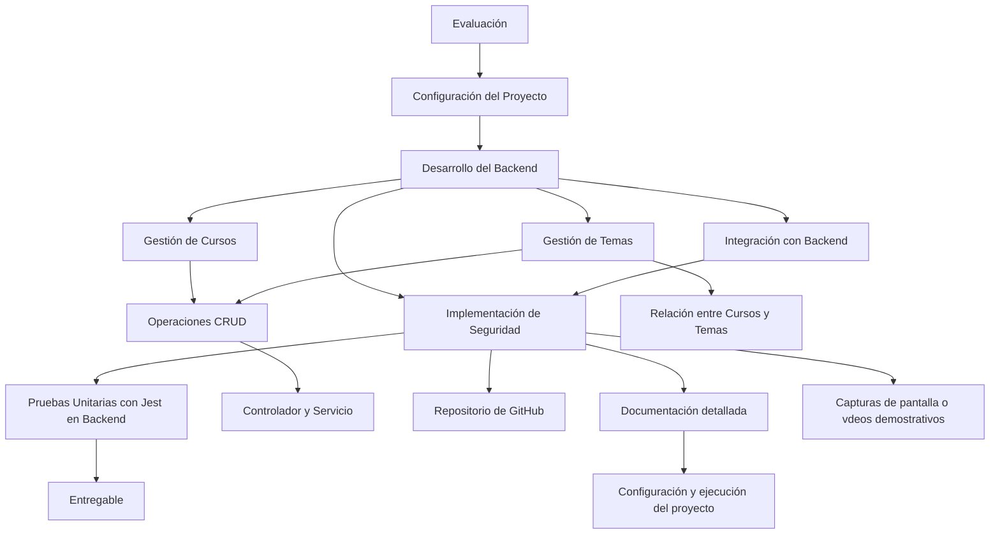

[](https://classroom.github.com/a/rrhU57ko)
<<<<<<< HEAD

=======
>>>>>>> master
# Sistema de Gestión de Cursos para Docentes


<<<<<<< HEAD

=======
>>>>>>> master
## Evaluación

Se evalúa la necesidad de desarrollar un sistema de gestión de cursos para docentes.

## Configuración del Proyecto

Se utiliza Nest.js para configurar el backend y se establece una base de datos MongoDB para almacenar la información de los cursos y los temas.

## Desarrollo del Backend

Se crea un módulo para la gestión de los cursos, con operaciones CRUD, así como un controlador y un servicio para la lógica de negocio relacionada. Se desarrolla también un módulo para la gestión de los temas de los cursos, estableciendo la relación entre cursos y temas.

## Implementación de Seguridad

Se implementan medidas de seguridad en el backend para proteger las rutas y acciones del sistema, utilizando técnicas como la autenticación basada en tokens JWT.

## Pruebas Unitarias con Jest en Backend

Se escriben pruebas unitarias para verificar el correcto funcionamiento de los controladores y servicios del backend, utilizando Jest como framework de pruebas.

<<<<<<< HEAD
### Ejecución del Servidor

1. Clona el repositorio desde GitHub utilizando el siguiente enlace: [Repositorio del Proyecto](https://classroom.github.com/a/rrhU57ko).
2. Abre una terminal y navega hasta la carpeta del proyecto clonado.
3. Instala las dependencias del proyecto ejecutando el siguiente comando:

```bash
   npm install
```

#### Necesario

1. Configura tu base de datos MongoDB y asegúrate de que esté en ejecución.

2. Ejecuta el siguiente comando para iniciar el servidor:

```bash
npm run start:dev
```

El servidor estará en funcionamiento y listo para recibir solicitudes.

### Prueba con Insomnia

Para realizar pruebas con Insomnia, puedes seguir estos pasos:

1. Abre la aplicación Insomnia en tu computadora.
2. Crea una nueva solicitud y selecciona el método HTTP adecuado (GET, POST, PUT, DELETE).
3. Ingresa la URL de la ruta de la API que deseas probar.
4. Proporciona los datos de la solicitud, como el cuerpo de la solicitud para crear nuevos cursos o temas.
5. Envía la solicitud y observa la respuesta del servidor.

##### Aquí tienes algunos datos de prueba para utilizar con Insomnia:

#### Datos de prueba para creación de temas:

```json
{
  "name": "Tema de Pruebas",
  "description": "Este es un tema de prueba para probar la funcionalidad."
}
```

Recuerda que debes registrar los temas antes de relacionarlos con los cursos.

#### Datos de prueba para creación de cursos:

```json
{
  "name": "Curso de Programación Avanzada",
  "description": "Aprende conceptos avanzados de programación.",
  "topics": ["ID-del-tema-1", "ID-del-tema-2"]
}
```

Recuerda reemplazar "ID-del-tema-1" y "ID-del-tema-2" con los IDs reales de los temas relacionados.

=======
>>>>>>> master
## Entregable

Se entrega un repositorio de GitHub con el código fuente del proyecto, documentación detallada sobre la configuración y ejecución del proyecto, y capturas de pantalla o vídeos demostrativos que muestren el sistema en funcionamiento.

<<<<<<< HEAD
Para visualizar y probar la generación del sistema backend, así como su consumo desde un Frontend, puedes utilizar herramientas como Thunder Client, Postman, Insomnia o RapidApiClient. Estas herramientas permiten realizar solicitudes HTTP a los endpoints del backend, lo que facilita la visualización de los datos y el funcionamiento del sistema en tiempo real.
=======
Para visualizar y probar la generación del sistema backend, así como su consumo desde un Frontend, puedes utilizar herramientas como Thunder Client, Postman, Insomnia o RapidApiClient. Estas herramientas permiten realizar solicitudes HTTP a los endpoints del backend, lo que facilita la visualización de los datos y el funcionamiento del sistema en tiempo real.
>>>>>>> master
